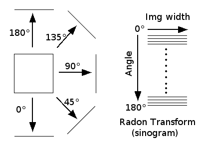
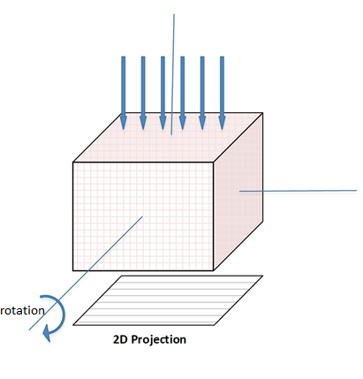

# 2D Projection of a 3D volume 

This is a Matlab implementation for taking 2D projection of a 3D object/volume at different angle without using any built-in Matlab functions. 

## What is projection ?
Taking projection of 3d object/volume means passing a set of parallel X-ray beam at a specific angle and calculating the attenuation of the X-ray beams on a detector plane. So at each angle the 3d object has a 2d projection. 

There are different ways of taking 2D projections from a 3D object/volume. I used the most fundamental approach which is known as **Radon transform**. In mathematics, Radon transform means taking the line integrals of all the parallel lines which pass over a 2D plane/space on a 1D function. Read more about Radon transform at https://en.wikipedia.org/wiki/Radon_transform. So, projection of a 2D plane/space is 1D. As digital 3D object/volume is nothing but combination of 2D slices, I used Radon transform for each slice of the volume. 1D projection of each slice becomes a 2D plane which can be referd as 2D projection of the given 3D object/volume at an specific angle. The rotation the object along an axis and repeating the process yields projections at different angle of the object. In the world of tomography these projections are combined to create a 3D scans (CT, MRI, etc.). 

Here is graphical interpretation of 1D and 2D projections for 2D and 3D case respectively. 

  

Matlab built-in function _radon_ does the same thing. This is an raw implementation of radon transform without using any built-in functions.  
